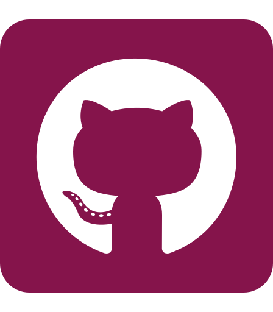

I'm Rebecca, a Software Development student from Dublin, Ireland.

- 👩🏻‍🏫  I'm currently working on my **Full-Stack Software Development** Professional Diploma with the [Code Institute](https://codeinstitute.net/ "Code Institute Homepage") and [UCD](https://www.ucd.ie/professionalacademy/ "UCD Professional Academy Homepage")
- 👩🏻‍🎓 I have a B.Sc in Digital Media and Computer Science from the University of Limerick, graduating with a 2:1
- 🥅 2021 Goals:
    - 🛒 Create my first E-Commerce website
    - 📚 Learn more about UX/UI
    - 🎓 Complete my Full-Stack Diploma with Distinction
    - 💻 Get my first Soft Dev job
    - 🌍 Go Travelling
- ⚡ Fun fact: When I'm not at my computer, you'll find me making a mess in the kitchen and calling it **baking** 🧁

### Languages:

### Frameworks | Libraries:

### Coding | Version Control: 

    
    

    <strong>Get in touch</strong>
    

        
        <!--  -->
          
    

